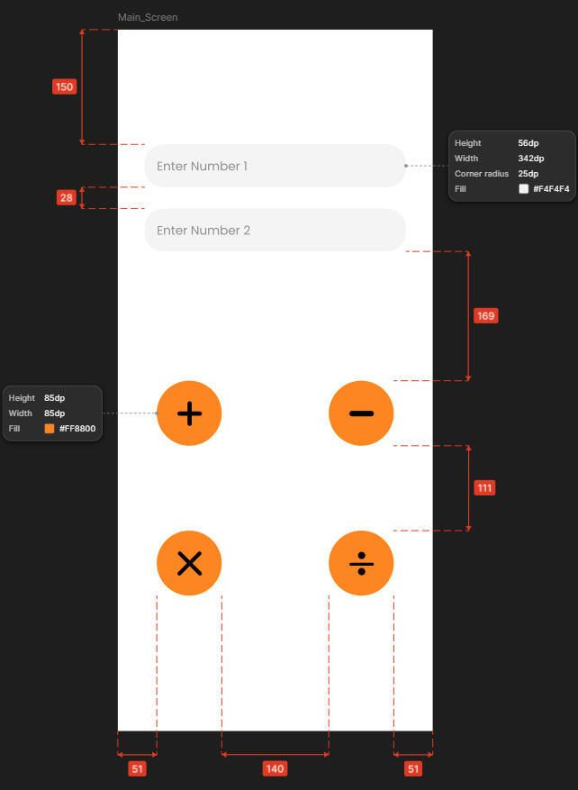
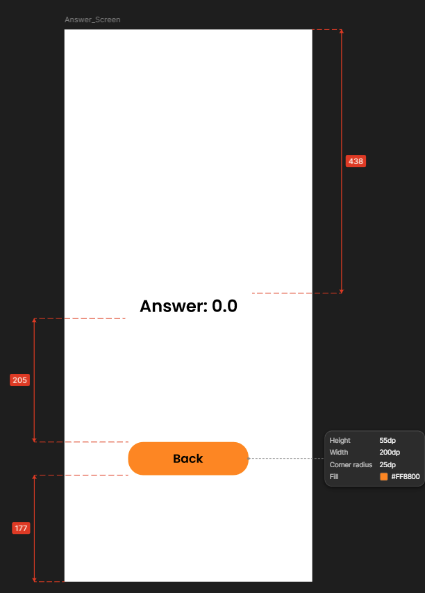
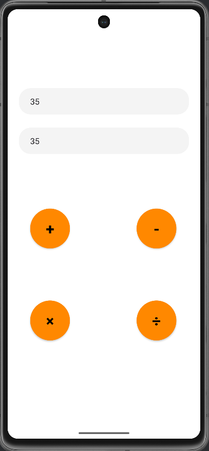
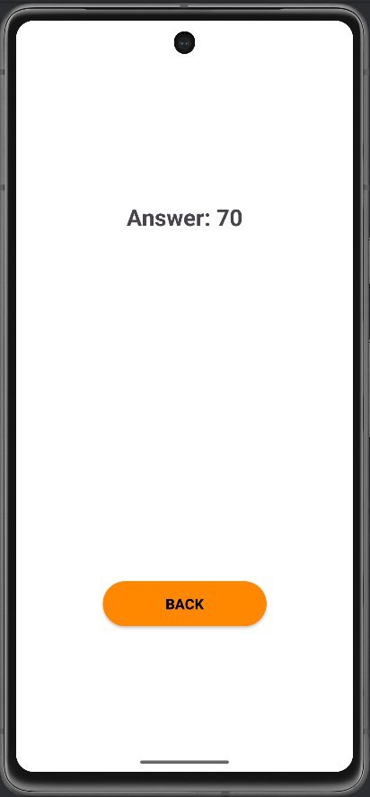

# 📱 MADD Lab 03 – Calculator App with Fragments

**Course:** SE4041 – Mobile Application Design and Development  
**Year:** 4 – Semester 1 (2025)

**Student ID:** IT22608918  
**Student Name:** Abeysinghe A.M.E.L

---

## 📖 Project Overview
This project is a simple **calculator app** developed in **Kotlin** using **Fragments**.  
The app demonstrates fragment-based navigation and clean UI design as required in **Lab Sheet 03**.

**Key Features:**
- Accepts two numeric inputs
- Performs the four basic arithmetic operations:
    - ➕ Addition
    - ➖ Subtraction
    - ✖ Multiplication
    - ➗ Division
- Displays results on a **separate fragment screen**
- Includes a **Back button** for navigation
- Minimal and user-friendly design

---

## 🛠️ Tech Stack
- **Language:** Kotlin
- **UI Design:** XML Layout + ConstraintLayout
- **Navigation:** Fragment Transactions
- **IDE:** Android Studio (Narwhal/Giraffe)
- **Minimum SDK:** 24 (Android 7.0)

---

## 🖼️ Screenshots

### 📌 UI Mockups
| Input Screen | Result Screen |
|--------------|---------------|
|  |  |

### 📌 Running Application
| Running Example 1 | Running Example 2 |
|-------------------|-------------------|
|  |  |

---

## 🚀 How to Run the Project
1. Clone the repository:
   ```bash
   git clone https://github.com/LakshithaAbeysinghe/MADD_Lab_03.git
